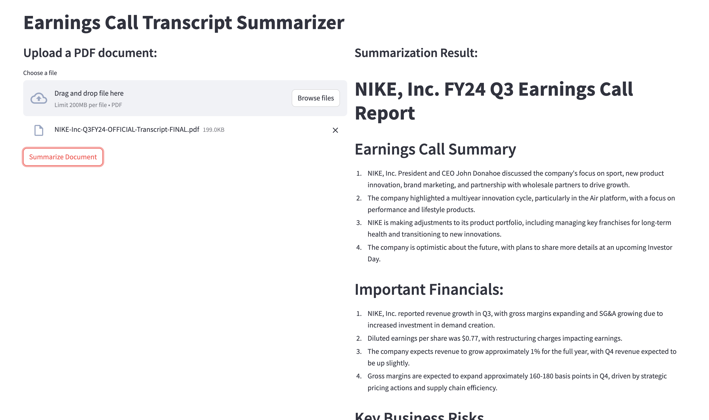

# Business Document Summarizer

A Streamlit app that summarizes a lengthy business PDF document (such as an earnings call transcript) into a structured business report using an OpenAI LLM via LangChain, and renders the summary to a downloadable PDF via Quarto.

**[Watch the demo](your-loom-link-here)**




**Tech stack:** Streamlit · LangChain · OpenAI API · Quarto

## Project Files

* `summary_report_app_pdf.py` — the Streamlit app. Upload a PDF, generate a Markdown summary (call highlights, financials, risks, conclusions), and export it to PDF (saved to your Downloads folder).
* `environment.yml` — conda environment spec (`ds4b_301p`) with all required packages.
* `credentials.yml` — API key used by the app (`openai`). Real file not committed - create and fill in your own based on the `credentials.yml.example` template

## Prerequisites

* Python (via conda, see below)
* [Quarto CLI](https://quarto.org/docs/get-started/) — required for PDF export
* A LaTeX distribution (e.g. [TinyTeX](https://quarto.org/docs/output-formats/pdf-engine.html)) — required by Quarto for PDF rendering
* An OpenAI API key

## Setup

1. Create and activate the conda environment:

    ```
    conda env create -f environment.yml
    conda activate ds4b_301p
    ```

2. Add your OpenAI API key to `credentials.yml`:

    ```yaml
    openai: sk-...
    ```

3. Install the [Quarto CLI](https://quarto.org/docs/get-started/) — required by the app's PDF generation feature.

## Running the App

```
streamlit run summary_report_app_pdf.py
```

Upload a PDF to the app, click **Summarize Document**, and the app will generate a structured Markdown summary. If Quarto is installed, it will also render and save a PDF version of the summary to your Downloads folder.

## How It Works

The app uses a `prompt_template` to guide the connected LLM's analysis. This iteration is tuned for earnings call transcripts — the prompt instructs the LLM to structure its markdown output with transcript-specific headings like "Earnings Call Summary." To analyze other types of business PDFs, just adjust the prompt template accordingly.

## Limitations

* Tested primarily on earnings call transcripts; other document types may need prompt adjustments (see above).
* Long transcripts may hit LLM context limits or increase API cost per run.
* PDF export depends on a working Quarto + LaTeX installation, which can be finicky to set up locally.